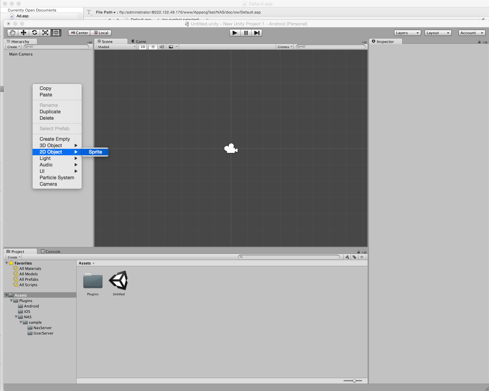
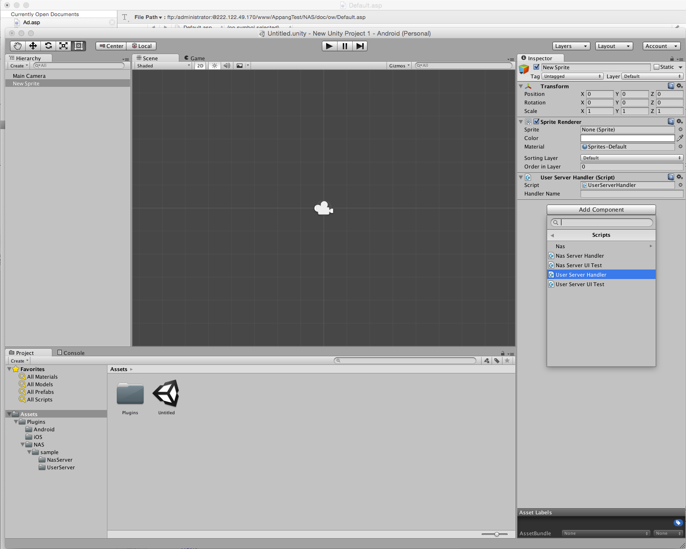
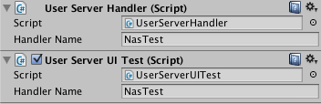

# NAS 오퍼월 Unity SDK 및 예제
NAS 오퍼월 Unit용 SDK 및 예제를 제공합니다.

## 목차
- [🔗⠀다른 플렛폼 SDK](#-다른-플렛폼-sdk)
- [📝⠀업데이트](#-업데이트)
    - [iOS 업데이트](#ios-업데이트)
    - [Android 업데이트](#android-업데이트)
- [📦⠀파일](#-파일)
- [👤️⠀개발자/매체 등록](#%EF%B8%8F-개발자-매체-등록)
- [🚀⠀SDK 연동](#-sdk-연동)
    - [라이브러리 추가](#라이브러리-추가)
    - [AndroidManifest.xml 설정](#androidmanifestxml-설정)
    - [초기화](#초기화)
    - [팝업 오퍼월 띄우기](#팝업-오퍼월-띄우기)
    - [임베드 오퍼월 삽입](#임베드-오퍼월-삽입)
    - [적립금 조회](#적립금-조회-nas-서버에서-적립금-관리-시-사용) _(NAS 서버에서 적립금 관리 시 사용)_
    - [적립금 사용 (아이템 구매)](#적립금-사용-아이템-구매-nas-서버에서-적립금-관리-시-사용) _(NAS 서버에서 적립금 관리 시 사용)_
- [🎲⠀예제 적용 방법](#-예제-적용-방법)

## 🔗 다른 플렛폼 SDK
- [`iOS SDK`](https://github.com/mafin-global/nas-offerwall-ios)
- [`Android SDK`](https://github.com/mafin-global/nas-offerwall-android)

## 📝 업데이트

### `iOS 업데이트`
- [`2020년 3월 31일`](https://github.com/mafin-global/nas-offerwall-ios/blob/master/docs/Update.md#2020년-3월-31일)
    - 통신 관련 버그 수정
- [`2020년 1월 30일`](https://github.com/mafin-global/nas-offerwall-ios/blob/master/docs/Update.md#2020년-1월-30일---내장-ui) - _내장 UI_
    - foreground 시 새로고침되지 않는 버그 수정
- [`2020년 1월 28일`](https://github.com/mafin-global/nas-offerwall-ios/blob/master/docs/Update.md#2020년-1월-28일---내장-ui) - _내장 UI_
    - 환경에 따라 오퍼월이 보이지 않는 현상 수정
- [전체 업데이트 목록 보기](https://github.com/mafin-global/nas-offerwall-ios/blob/master/docs/Update.md)

### `Android 업데이트`
- [`2020년 6월 26일`](https://github.com/mafin-global/nas-offerwall-android/blob/master/docs/Update.md#2020년-6월-26일)
    - 테스트 모드와 관련된 버그 수정
- [`2019년 10월 14일`](https://github.com/mafin-global/nas-offerwall-android/blob/master/docs/Update.md#2019년-10월-14일)
    - Android Q(10) 대응 버그 수정
- [`2019년 9월 19일`](https://github.com/mafin-global/nas-offerwall-android/blob/master/docs/Update.md#2019년-9월-19일)
    - Android Q(10) 대응
    - 초기화 완료 이벤트 추가 (NASWall.setOnInitListener)
- [`전체 업데이트 목록 보기`](https://github.com/mafin-global/nas-offerwall-android/blob/master/docs/Update.md)

## 📦 파일
- [`/sdk`](sdk) : 최종 릴리즈 SDK 파일
    - [`NASWall_Unity_xxxxxxxx..unitypackage`](sdk/NASWall_Unity_20191014.unitypackage) : SDK 라이브러리 파일

## 👤️ 개발자/매체 등록
[오퍼월 적용 가이드 문서](https://github.com/mafin-global/nas-offerwall#%EF%B8%8F-%EA%B0%9C%EB%B0%9C%EC%9E%90-%EB%93%B1%EB%A1%9D) 를 참고해주세요.

## 🚀 SDK 연동

프로젝트에 `/sdk/NASWall_Unity.unitypackage` 파일을 `Import` 합니다.

### `Android 설정`
- Proguard 설정
    > NAS SDK 에는 이미 Proguard가 적용되어 있습니다. Proguard 적용 시 NAS SDK는 제외시켜야 정상 작동합니다.
    > ```
    > # NAS SDK Proguard
    > -dontwarn com.nextapps.naswall.**
    > -keep class com.nextapps.naswall.** {
    >     *;
    > }
    > ```

- AndroidManifest.xml 설정
    > AndroidManifest.xml 에 다음 권한을 추가합니다.
    > ```
    > <uses-permission android:name="android.permission.INTERNET"/>
    > <uses-permission android:name="android.permission.READ_PHONE_STATE"/>
    > <uses-permission android:name="android.permission.ACCESS_WIFI_STATE"/>
    > <uses-permission android:name="android.permission.GET_ACCOUNTS" />
    > ```

    > 프로젝트의 Target SDK를 23(Android 6.0) 이상으로 지정 한 경우, 사용자가 위의 권한을 허가하지 않으면 오퍼월이 정상적으로 작동하지 않을 수 있습니다.
    안드로이드 6.0 이상에서는 오퍼월을 사용하기전에 위의 권한들이 모두 허용되어 있는지 먼저 확인 후 사용하시기 바랍니다. 만약 권한이 없다면 사용자에게 권한 요청을 하시기 바랍니다.
    사용자에게 권한을 요청하는 방법은 다음 [공식 문서](http://developer.android.com/intl/ko/training/permissions/requesting.html) 를 참고하세요.

    > `AndroidManifest.xml`에 `앱 Key`를 설정합니다. `[APP_KEY]`부분을 앱 등록 후 받은 32자리 키로 대체합니다.
    > ```
    > <meta-data android:name="naswall_app_key" android:value="[APP_KEY]" />
    > ```

    > `AndroidManifest.xml` 의 `application` 에 다음 정보를 추가합니다.
    > ```
    > <activity android:name="com.nextapps.naswall.NASWallBrowser" android:configChanges="keyboardHidden|orientation|screenSize">
    >     <intent-filter>
    >        <action android:name="android.intent.action.VIEW"/>
    >        <category android:name="android.intent.category.DEFAULT"/>
    >        <category android:name="android.intent.category.BROWSABLE" />
    >     </intent-filter>
    > </activity>
    > 
    > <activity android:name="com.nextapps.naswall.NASWall" android:configChanges="keyboardHidden|orientation" />
    > ```

### `초기화`
앱 실행 부분에 `초기화 함수`를 호출합니다.

`testMode`는 개발 테스트 버전인 경우에만 `true` 를 입력하고, 배포 버전에서는 `false` 를 입력합니다.

- ***개발자 서버에서 적립금 관리 시 사용***
    ```
    void Start ()
    {
        bool testMode = false;
        Nas.Plugin.Instance.init(testMode, _handlerName);
    }
    ```
 
- ***NAS 서버에서 적립금 관리 시 사용***
    > `사용자 ID`는 사용자를 구분하기 위한 고유값입니다. NAS 서버에서 `사용자 ID` 별로 적립금이 쌓이기 때문에 사용자별로 고유한 값을 입력해야합니다.
    ```
    void Start ()
    {
        bool testMode = false;
        string userId = "사용자 ID";
        Nas.Plugin.Instance.init(testMode, userId, _handlerName);
    }
    ```

### `오퍼월 띄우기`
오퍼월을 보여주고자 하는 부분에 다음 코드를 추가합니다.

- ***개발자 서버에서 적립금 관리 시 사용***
    > `USER_DATA`에 개발자가 사용자를 구분하기 위한 값을 입력합니다. 광고 참여 완료 후 개발자 서버로 `콜백 URL` 호출 시. `[USER_DATA]` 파라메터로 전달됩니다. 

- ***NAS 서버에서 적립금 관리 시 사용***
    > `USER_DATA`에 `초기화 함수` 호출 시 사용한 `userId`를 입력합니다.

```
string userData = "USER_DATA";
Nas.Plugin.Instance.open(userData);
```

***타겟팅 광고 노출 방법***
    
기본적으로 오퍼월에는 타겟팅 광고는 노출되지 않습니다.
사용자의 `연령` 또는 `성별` 정보가 있는 경우, 아래와 같은 방법으로 타겟팅 광고를 노출시킬 수 있습니다.

```
string userData = "USER_DATA";
int age = 10; // 연령 (연령 정보가 없을 경우 0 으로 설정)
Nas.SEX sex = Nas.SEX.SEX_MALE; // 성별 (SEX_UNKNOWN=성별정보없음, SEX_MALE=남자, SEX_FEMALE=여자)
Nas.Plugin.Instance.open(userData, age, sex);
```

### `적립금 조회` _(NAS 서버에서 적립금 관리 시 사용)_
`getUserPoint` 함수를 호출하여 사용자 적립금을 조회할 수 있습니다.

- 성공 시 `OnUserPointSuccess(int point, string unit)` 이벤트가 발생합니다.
    - `point` : 적립 금액
    - `unit` : 적립 금액 단위

- 실패 시 `OnUserPointError(int code)` 이벤트가 발생합니다.
    - `code` : 오류 코드

```
Nas.Plugin.Instance.getUserPoint();
```

### `적립금 사용 (아이템 구매)` _(NAS 서버에서 적립금 관리 시 사용)_
`Nas.Plugin.Instance.purchaseItem(string itemId)` 함수를 호출하여 아이템을 구매하고 사용자 적립금을 사용할 수 있습니다.

`Nas.Plugin.Instance.purchaseItem(string itemId, int purchaseCount)` 함수를 사용하면 구매 수량을 지정하여 구매할 수 있습니다.

- 성공 시 `OnPurchaseItemSuccess(string itemId, int purchaseCount, int point, string unit)` 이벤트가 발생합니다.
    - `itemId` : 아이템 ID
    - `purchaseCount` : 구매 수량
    - `point` : 구매 후 남은 적립 금액
    - `unit` : 적립 금액 단위

- 실패 시 `OnPurchaseItemError(string itemId, int purchaseCount, int errorCode)` 이벤트가 발생합니다.
    - `itemId` : 아이템 ID
    - `purchaseCount` : 구매 수량
    - `errorCode` : 오류 코드
        - `-10` : 앱KEY 가 잘못되었습니다.
        - `-11` : 잘못된 아이템ID 입니다.
        - `-12` : 잘못된 구매 수량 입니다.
        - `그외` : 기타 오류

- 적립금 부족 시 `OnPurchaseItemNotEnoughPoint(string itemId, int purchaseCount)` 이벤트가 발생합니다.
    - `itemId` : 아이템 ID
    - `purchaseCount` : 구매 수량

```
Nas.Plugin.Instance.purchaseItem("아이템아이디");
```

## 🎲 예제 적용 방법
1. `Assets > Import Package > Custom Package...` 메뉴에서, `NASWall_Unity.unitypackage` 파일을 선택하여 `Package`를 추가합니다.

1. `2D Object > Sprite` 를 추가합니다.
    
    
1. `Inspector`의 `Add Compoment`를 클릭하여, `Scripts > User Server Handler`를 추가합니다. (`NAS 서버에서 적립금을 관리`하는 경우에는 `Nas Server Handler`를 추가합니다.)

1. `Inspector`의 `Add Compoment`를 클릭하여, `Scripts > User Server UI Test`를 추가합니다. (`NAS 서버에서 적립금을 관리`하는 경우에는 `Nas Server UI Test`를 추가합니다.)
    
    
1. `User Server Handler`, `User Server UI Test` 의 `Handler Name`을 동일하게 입력합니다.
    
    
1. 빌드 후 실행합니다.

